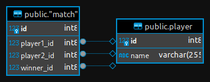

# Tennis match scoreboard project

Created according to the technical specifications presented
in [this course](https://zhukovsd.github.io/java-backend-learning-course/Projects/TennisScoreboard/)

# Overview

A web application that implements a scoreboard for a tennis match.

## Technologies / tools used:

- Kotlin
- Servlet
- JSP
- Hibernate
- PostgreSQL
- Docker
- Gradle
- Junit

## Database diagram

## 